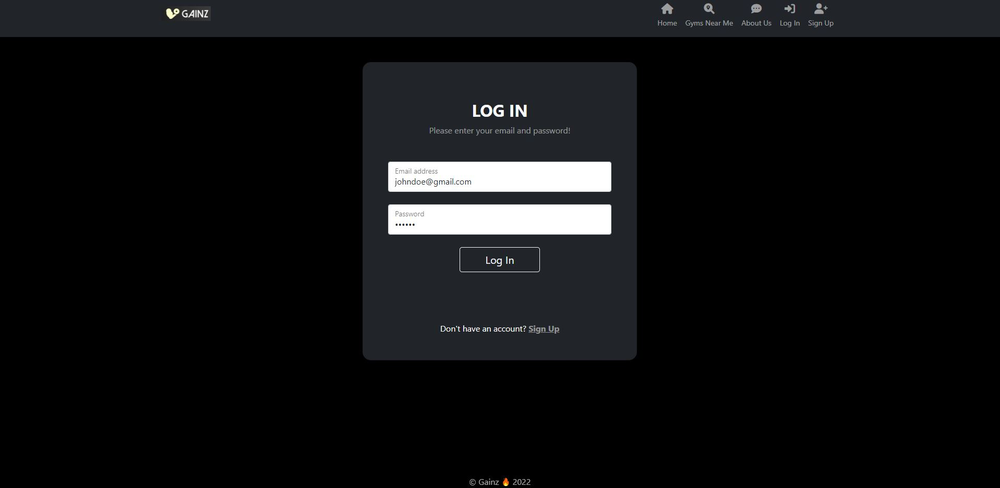
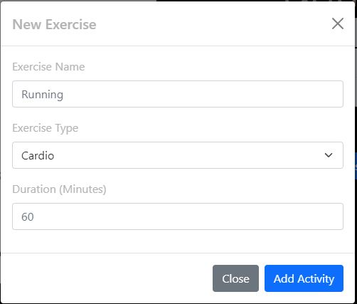

# Workout Tracker

## Description 

A simple daily workout tracker thats logs multiple exercises in a workout on a given day limited by user id.
This will allow consumer to reach their fitness goals quicker when they track their workout progress.

### User Story

* As a user, I want to be able to view create and track daily workouts. 
* I should be able to create a new user or login with an existing accounting to see my workout progress.
* I want to be able to log multiple exercises in a workout on a given day. 
* I should also be able to track the name, type, and duration of exercise for that given day.
* I should be able to find the closest gym near me when searching my neighborhood or Zip Code.

Repo: https://github.com/andrewyu22/work-out-tracker

Link: https://gainz-workout.herokuapp.com/

---
## Table of Contents 

* [Installation](#installation)
* [Usage](#usage)
* [License](#license)
* [Contributing](#contributing)
* [Tests](#tests)
* [Credits](#credits)
* [Resources](#resources)

---
## Installation

1) "npm install" to install all required dependency
2) Set up ".env" file to connect to database
---
## Usage 

### HomePage

### Find a Gym Near You

### Sign Up / Log In

### My Workout
Select a Date to see your exercise for the day

Add a new Exercise by clicking on "Add Exercise", fill out the form and click "Add Activity"

You can also Edit or Delete an exercise by clicking on the following buttons in Action

### Change Profile Picture
Top Left corner, click on the image dropdown and select "Update Profile Picture"

Choose a new image, by click "Choose File", Once you select the image you want to upload, click "Submit"

### Meet the Team

---
## License

No Licenses for this project!

---
## Contributing

No contribution information for this project!

---
## Tests

1) Log in to Mysql from the Terminal in the root folder of the project and type: "source db/schema.sql" 
2) Quit out MySql Terminal. In the bash terminal type in: "npm run seeds"

---
## Credits

* [Andrew Yu](https://www.github.com/andrewyu22)
* [Marcio Araujo](https://github.com/Jump89)
* [Fayaz Lalani](https://github.com/fayazl)
* [John Harris](https://github.com/jharris92)

---
## Resources

### Front End 
* HTML
* CSS
* Bootstrap 5.0
* jQuery

### Back End 
* Node.js
* Javascript
* [express.js](https://www.npmjs.com/package/express)
* [express-handlebars](https://www.npmjs.com/package/express-handlebars)
* [express-session](https://www.npmjs.com/package/express-session)
* [MySql](https://www.npmjs.com/package/mysql2)
* [Sequelize](https://www.npmjs.com/package/sequelize)
* [connect-session-sequelize](https://www.npmjs.com/package/connect-session-sequelize)
* [dotenv](https://www.npmjs.com/package/dotenv)
* [bcrypt](https://www.npmjs.com/package/bcrypt)
* [yelp-fusion](https://www.npmjs.com/package/yelp-fusion)
* [Multer](https://www.npmjs.com/package/multer)
